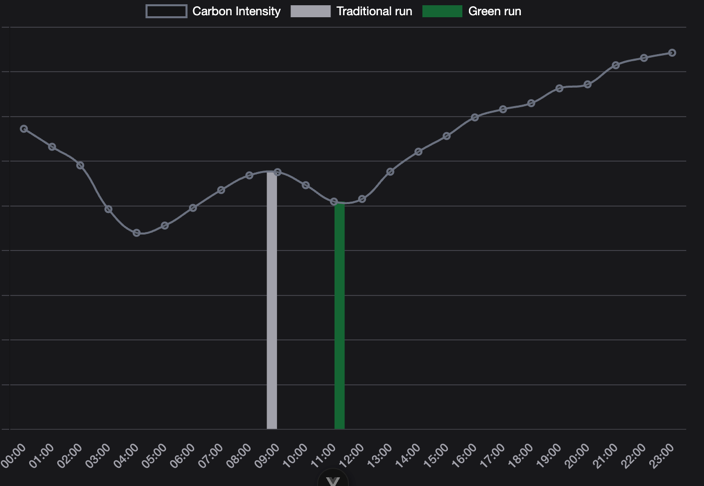
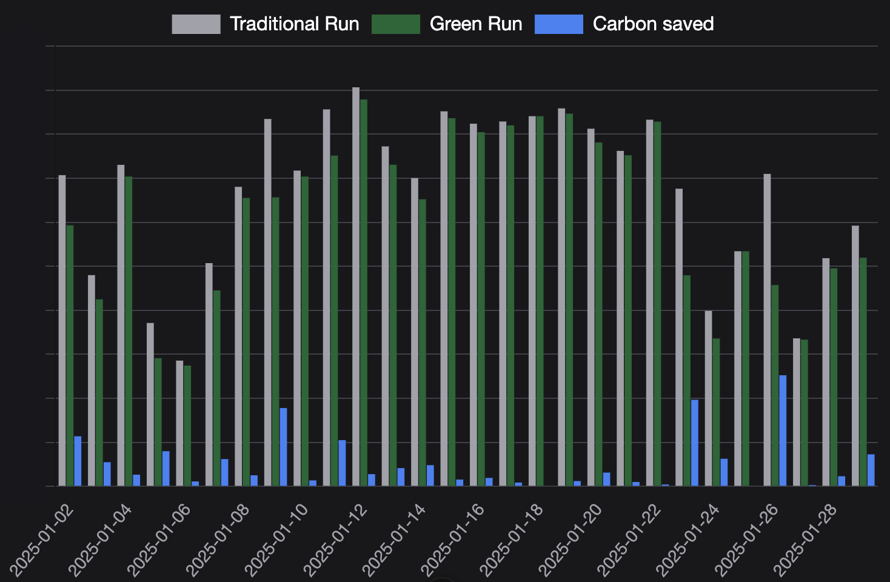

# Green scheduling without effort

This open-source job scheduler for Java developers revolutionizes the way you manage your tasks by dynamically assigning jobs to timeslots with greener energy. By effortlessly integrating this scheduler into your software, you can significantly reduce your carbon footprint and contribute to a more sustainable future. Embrace the power of green energy and make your software run greener with ease.

Let's look at an example. We have a job currently running at 9 o'clock that runs roughly an hour. From a business point of view we do not really care when it runs. As long as the job is finished before the end of the working day. So we could schedule it anywhere between 8:00 - 17:00.

The scheduler will calculate when the best (greenest) time is to run the job. For example on the day in the screenshot below, running at 11 o'clock would be more sustainable to run the job. (As the graph shows, there are even better spots outside the window)



Over a month we can see significant reductions in the carbon footprint of this job:


## Current state

This scheduler uses carbonintensity data delivered by carbonintensity.io. This data is accessible with a free account using the following api-key:

This scheduler is tested in spring and spring-boot for the zone NL. See issues for actual improvements and feature requests.

## How to build

The build instructions are available in the [contribution guide](CONTRIBUTING.md).

## Usage

Currently, the carbon intensity aware scheduling is not published yet. To use the scheduler see [How to build](#how-to-build) on how to install the package locally.

Add the following dependency to the pom:
```xml
<dependency>
    <groupId>io.carbonintensity</groupId>
    <artifactId>scheduler-spring-boot-starter</artifactId>
    <version>999-SNAPSHOT</version>
</dependency>
```

In the application.yaml add the following config including the [APIKey](#requesting-an-api-key):

```yaml
greenScheduled:
  apiKey: { CARBONINTENSITY_API_KEY }
  api-url: https://carbonintensity-o.cloud.first8.nl
  enabled: true
```

Then apply the `@GreenScheduled` annotation on the to be scheduled method. For an example annotation see the [spring-boot-demo](https://github.com/carbonintensityio/green-scheduling-spring-boot-demo) There are 2 types of schedulers:

### Requesting an APIkey

To get an API-key to use the GreenScheduled annotation, please email `carbonintensity(at)first8(dot)nl` with the subject "Requesting GreenScheduled APIKey"

#### Fixed

A scheduler in starting each day in the configured fixed window, where the actual start-time is calculated using the carbon intensity on the set zone and the configured estimated duration of the job. Optionally, a timezone can be configured in the annotation to specify in which timezone the start and end-time of the fixedWindow are. When no timezone is configured, it will default to the system-default timezone. Note that if the application is redeployed during this window, it might run again.

Using the "regular" scheduler:

```java

@Scheduled(cron = "0 0 9 * * ?", zone = "Europe/Amsterdam")
public void runAt9AM() {
    // Task to be executed at 6 AM every day
}
```

This would be replaced by the `@GreenScheduled` annotation. The job below might start at 8:00, 17:00 or anywhere in between, depending on the carbon intensity calculation. Also see javadoc of `@GreenScheduled`.
```java

@GreenScheduled(fixedWindow = "08:00 17:00", duration = "1h", zone = "NL", timeZone = "Europe/Amsterdam")
public void greenFixedWindowJob() {
    // Task to be started at the greenest moment between 08:00 and 17:00
}
```

#### Successive (experimental)

A scheduler starting at the lowest carbon intensity for the zone within the configured gaps, keeping in mind the duration and zone while calculating the optimal starting time of the job.

Using the "regular" scheduler to run a process every 3 hours:
```java

@Scheduled(cron = "0 0 */3 * * ?", zone = "Europe/Amsterdam")
public void runEvery3Hours() {
    // Task to be executed every 3 hours
}
```

Will be replaced by the `@GreenScheduled` annotation. In the example below an initial maximum gap of 3h, the scheduler will find the start-time with the lowest carbon intensity within the first 3 hours of deployment as initial starting point. To then have a minimum gap of 1h and max of 4h between each consecutive run. Also see javadoc of `@GreenScheduled`.

```java
@GreenScheduled(successive = "3h 1h 4h", duration = "PT30M", zone = "NL")
public void greenSuccessiveWindowJob() {
    // Scheduled job process starting at the greenest moment in the specified window
}
```

## Acknowledgements

The maven project structure and all documentation regarding contribution is adapted from
what the [Quarkus](https://github.com/quarkusio/quarkus) community has created. Further acknowledgements can be found in the [NOTICE](NOTICE) file